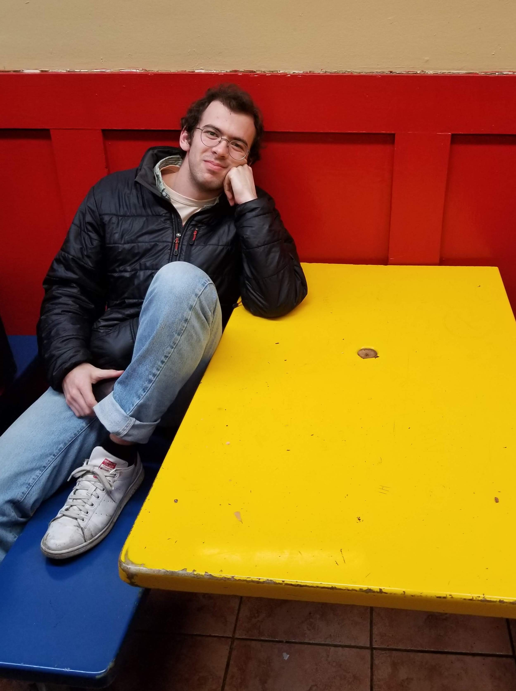
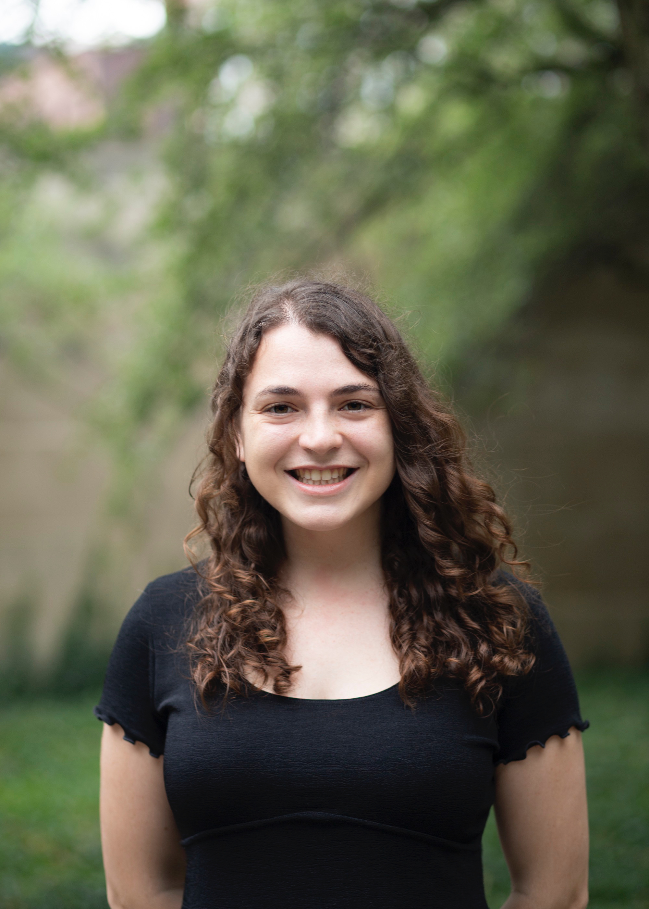

# Welcome the Rhode Island Opioid Data Journalism Project

We are a multidisciplinary group of journalists and data scientists from Brown University, led by Pulitzer Prize-winning journalist Tracy Breton. Over the past year, we have worked together to investigate the opioid epidemic in Rhode Island and tell critical stories about a decades-long national crisis, producing dozens of stories along the way. Journalists have found compelling stories about opioids in RI, ranging from human interest to data-driven investigation. At the same time, we've utilized the expertise and technical know-how of data scientists to dig into daunting datasets and create evocative and informative graphics. We hope these pieces will be published in early 2021.

## Articles
We've broken up our project into multiple sections as follows:

### How Rhode Island's Criminal Justice System Has Responded to the Opioid Epidemic (more tk)
- [An Inside Look at 30 years of Narcotics Prosecutions in Rhode Island](https://htried.github.io/opioid-journalism/51683a4d5705501cd25b927086d2ec088354fc55/html/drafts/court_data.html) — Lena Renshaw, Colleen Cronin, Gaya Gupta and Marina Hunt
- [Adult Drug Court: Rhode Island’s Judiciary Takes a Public Health Approach to the Opioid Crisis](https://htried.github.io/opioid-journalism/51683a4d5705501cd25b927086d2ec088354fc55/html/drafts/adult_drug_court.html) — Ivy Scott
- [Rhode Island's New Diversion Program](https://htried.github.io/opioid-journalism/51683a4d5705501cd25b927086d2ec088354fc55/html/drafts/ri_diversion.html) (sidebar to Adult Drug Court story) — Ivy Scott
- [Kristen's Law](https://htried.github.io/opioid-journalism/51683a4d5705501cd25b927086d2ec088354fc55/html/drafts/kristens_law.html) — Marina Hunt
- [Policing Drug Crimes in Providence](https://htried.github.io/opioid-journalism/51683a4d5705501cd25b927086d2ec088354fc55/html/drafts/week_in_policing.html) — Marina Hunt

### Who is Overdosing and Where — A Micro Look at Opioid Deaths in Providence Over the Past Three Years
- [Three Years of Fatal Overdoses in Providence](https://htried.github.io/opioid-journalism/51683a4d5705501cd25b927086d2ec088354fc55/html/drafts/providence_overdoses.html) — Olivia George, Marina Hunt, and Colleen Cronin

### Pharmacies and Addiction
- [Nine years, 329 million pills](https://htried.github.io/opioid-journalism/51683a4d5705501cd25b927086d2ec088354fc55/html/drafts/pills_pharmacies.html) — Olivia George and Hal Triedman
- [Injured Workers and Opioids](https://htried.github.io/opioid-journalism/51683a4d5705501cd25b927086d2ec088354fc55/html/drafts/injured_workers_opioids.html) — Maia Rosenfeld

### Rhodes Pharmaceuticals — Rhode Island's Opioid Manufacturing Base
- [For Nearly a Decade, Two RI Opioid Manufacturers Made Billions of Opioid Doses](https://htried.github.io/opioid-journalism/51683a4d5705501cd25b927086d2ec088354fc55/html/drafts/rhodes.html) — Hal Triedman

### Doctors and the Opioid Epidemic (more tk)
- [Policing Doctors](https://htried.github.io/opioid-journalism/51683a4d5705501cd25b927086d2ec088354fc55/html/drafts/bad_docs.html) — Li Goldstein
- [The Opioid Influencers](https://htried.github.io/opioid-journalism/51683a4d5705501cd25b927086d2ec088354fc55/html/drafts/opioid_influencers.html) — Hal Triedman
- [A Doctor's Downfall](https://htried.github.io/opioid-journalism/51683a4d5705501cd25b927086d2ec088354fc55/html/drafts/huntington.html) — Li Goldstein

### The Human Toll (more tk)
- [He Could Not Be Saved](https://htried.github.io/opioid-journalism/51683a4d5705501cd25b927086d2ec088354fc55/html/drafts/livingstone.html) — Max Kozlov
- ["Recovery is Possible": One woman’s fight to save her own life and, now, the lives of others.](https://htried.github.io/opioid-journalism/51683a4d5705501cd25b927086d2ec088354fc55/html/drafts/roxxanne_newman.html) — Olivia George
- [Not Just a White Problem: Minorities Are Dying of Opioid Overdoses. Rhode Island is Fighting to Stop It](https://htried.github.io/opioid-journalism/51683a4d5705501cd25b927086d2ec088354fc55/html/drafts/not_just_a_white_problem.html) — Gaya Gupta and Ivy Scott
- [Stigma and Addiction](https://htried.github.io/opioid-journalism/51683a4d5705501cd25b927086d2ec088354fc55/html/drafts/opioid_stigma.html) — Lucas Fried and Nell Salzman
- [Grandparents Raising Children of Those Lost to Addiction](https://htried.github.io/opioid-journalism/51683a4d5705501cd25b927086d2ec088354fc55/html/drafts/grandparents.html) — Olivia George
- [She Lost Both Parents To Opioids But Is Thriving Under Her Grandparents' Care](https://htried.github.io/opioid-journalism/51683a4d5705501cd25b927086d2ec088354fc55/html/drafts/jurczyk_grandparents.html) — Maia Rosenfeld

### Lives Lost Too Soon — 11 Portraits of Grief
- [Alex F. Minteer](https://htried.github.io/opioid-journalism/51683a4d5705501cd25b927086d2ec088354fc55/html/drafts/portraits_of_grief_alex_minteer.html) — Lucas Fried
- [Alexander Charles Perry](https://htried.github.io/opioid-journalism/51683a4d5705501cd25b927086d2ec088354fc55/html/drafts/portraits_of_grief_alex_perry.html) — Colleen Cronin
- [William L. Huntley](https://htried.github.io/opioid-journalism/51683a4d5705501cd25b927086d2ec088354fc55/html/drafts/portraits_of_grief_bill_huntley.html) — Ivy Scott
- [Jason Broomfield](https://htried.github.io/opioid-journalism/51683a4d5705501cd25b927086d2ec088354fc55/html/drafts/portraits_of_grief_jason_broomfield.html) — Lucas Fried
- [Jason Ferri](https://htried.github.io/opioid-journalism/51683a4d5705501cd25b927086d2ec088354fc55/html/drafts/portraits_of_grief_jason_ferri.html) — Olivia George
- [Jason Lother](https://htried.github.io/opioid-journalism/51683a4d5705501cd25b927086d2ec088354fc55/html/drafts/portraits_of_grief_jason_lother.html) — Olivia George
- [Jessica Ahearn](https://htried.github.io/opioid-journalism/51683a4d5705501cd25b927086d2ec088354fc55/html/drafts/portraits_of_grief_jessica_ahearn.html) — Olivia George
- [James L. Angell III](https://htried.github.io/opioid-journalism/51683a4d5705501cd25b927086d2ec088354fc55/html/drafts/portraits_of_grief_jim_angell.html) — Lucas Fried
- [Kasia M. Jurczyk](https://htried.github.io/opioid-journalism/51683a4d5705501cd25b927086d2ec088354fc55/html/drafts/portraits_of_grief_kasia_jurczyk.html) — Maia Rosenfeld
- [Kemah Tolston](https://htried.github.io/opioid-journalism/51683a4d5705501cd25b927086d2ec088354fc55/html/drafts/portraits_of_grief_kemah_tolston.html) — Colleen Cronin
- [Peter Michael Angelone](https://htried.github.io/opioid-journalism/51683a4d5705501cd25b927086d2ec088354fc55/html/drafts/portraits_of_grief_peter_angelone.html) — Colleen Cronin

### Attacking the Problem (more tk)
- [The Future of Overdose Prevention: Getting Naloxone into the Hands of Rhode Islanders Everywhere](https://htried.github.io/opioid-journalism/51683a4d5705501cd25b927086d2ec088354fc55/html/drafts/naloxone.html) — Ivy Scott
- [In an Effort to Stop One Opioid Epidemic, the VA Started Another](https://htried.github.io/opioid-journalism/51683a4d5705501cd25b927086d2ec088354fc55/html/drafts/va_osi.html) — Greer Brigham
- [VA Hospital Tries to Help Addicted Vets](https://htried.github.io/opioid-journalism/51683a4d5705501cd25b927086d2ec088354fc55/html/drafts/ri_va.html) — Greer Brigham
- [RI Workers' Compensation System Takes On The Opioid Epidemic](https://htried.github.io/opioid-journalism/51683a4d5705501cd25b927086d2ec088354fc55/html/drafts/workers_comp.html) — Maia Rosenfeld

## Authors (more tk)
 
Hal Triedman is a December 2020 graduate of Brown University, with degrees in Computer Science and History. This project was his first experience with data journalism and computer-aided reporting, and he hopes to pursue the intersection of CS and journalism further as he starts his career.
  

 
Olivia George is a junior at Brown University studying History and plans to pursue a career in investigative journalism. She has written for the Providence Journal and Teen Vogue, and this summer she will intern at The Virginian-Pilot.
  

 
Colleen Cronin is a senior at Brown concentrating in English on the non-fiction track. Colleen was previously the Editor-in-Chief of The Brown Daily Herald and hopes to pursue journalism after she graduates.
  

 
Greer Brigham is a recent graduate from Brown University where he studied political science and economics. The service of his father, Lt. Henry D. Brigham III, USS Fahrion (FFG-22), inspired Greer to cover the opioid epidemic's effects on veterans. Greer is currently using his background in politics, economics, and journalism to investigate issues related to income inequality. 
  

 
Li Goldstein is a junior at Brown University concentrating in English, Nonfiction Writing. She currently works as a managing editor at The Brown Daily Herald, and hopes to pursue a career in journalism after graduation.
  

 
Maia Rosenfeld is a Data Reporter and Scripps Howard Fellow at the Scripps Washington Bureau. She graduated from Brown in 2020, where she concentrated in Literary Arts and served as Metro News Editor for The Brown Daily Herald.
  

 
Gaya Gupta is a sophomore at Brown concentrating in computer science and English. She writes for The College Hill Independent and hopes to pursue a career melding reporting and data science as a member of an investigative reporting team. 
  

 
Lucas Fried is a senior at Brown studying public policy and economics. He loves writing about people and politics and aims to use his words to work on issues of civic engagement after graduation.  

Jane Yang is a junior at Brown University concentrating in Applied Math- Computer Science and appreciates the work of fellow student journalists.  

 
Tracy Breton was an investigative and legal affairs reporter for The Providence Journal for 40 years and in 1994, was part of a team of reporters that won a Pulitzer Prize for a series of stories uncovering corruption in Rhode Island’s court system. She has been teaching journalism classes in the Nonfiction Writing Program of Brown University’s Department of English since 1997. Students she has taught at Brown now work at some of the nation’s most prestigious news media outlets. She is passionate about finding and reporting untold stories and training the next generation of journalists to do the job right. This year-long project was her brainchild and the first at Brown to formally integrate computer-assisted reporting from data science students with reporting by journalism students.
  

## Datasets
We've looked at a rich variety of data sources to get a deep understanding of the opioid crisis in Rhode Island:
- ARCOS drug data (contact [Hal Triedman](mailto:htriedman@gmail.com) for access to this dataset through Google Cloud) 
- US Census data
- Publicly available Rhode Island Department of Health data on overdose deaths, emergency room visits, and naloxone use and distribution
- Detailed overdose records for the City of Providence
- Publicly available doctor payment data from the Center for Medicare/Medicaid Services
- Digitized Rhode Island Judiciary records from 1980 - 2019
- Lawsuits against opioid manufacturers, distributors and pharmacies filed in Rhode Island and elsewhere
- US bankruptcy court documents
- Rhode Island Board of Medical Licensure and Discipline records
- Massachusetts Board of Registration in Medicine records
- Police reports from Providence, RI; Newport, RI; Fall River, MA; Cohasset, MA; and elsewhere

## Tools
We're using several different tools to store, process, and visualize data:
- Google Cloud Platform
- BigQuery
- Google Datastudio
- Google Colab
- Github Pages (for mocking up articles)
- d3.js

The members of the data science and graphics team are Lena Renshaw, Cece Xiao, Gaby Rizk, Iris Lee, Jane Yang, and Hal Triedman. This project started as a part of Brown University's CS for Social Change practicum.

Hal Triedman (github: [htried](https://github.com/htried)), Gaby Rizk, and Jane Yang coded this site, and Hal Triedman led the CS for Social Change team.
